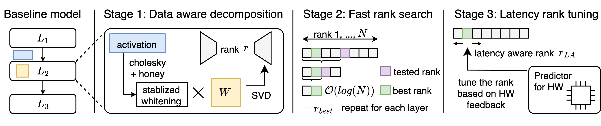

# FLAR-SVD: Fast and Latency-Aware Singular Value Decomposition for Model Compression

This is the official repository of
[**FLAR-SVD: Fast and Latency-Aware Singular Value Decomposition forModel Compression**](https://openaccess.thecvf.com/content/CVPR2025W/MAI/papers/Thoma_FLAR-SVD_Fast_and_Latency-Aware_Singular_Value_Decomposition_for_Model_Compression_CVPRW_2025_paper.pdf)
*Moritz Thoma, Jorge Villasante, Emad Aghajanzadeh, Shambhavi Balamuthu Sampath, Pierpaolo Mori, Maximilian Groetzinger, Daniil Dylkin, Manoj-Rohit Vemparala, Nael Fasfous, Alexander Frickenstein, Daniel Mueller-Gritschneder, Ulf Schlichtmann.* **CVPRW 2025**



<details>
  <summary>
  <font size="+1">Abstract</font>
  </summary>
Advanced deep learning architectures have achieved exceptional prediction performance but come with significant computational demands, posing challenges for deployment on resource-constrained devices such as edge devices. While pruning techniques offer a way to reduce model complexity, they often lead to substantial accuracy loss and can require extensive retraining. Alternatively, Singular Value Decomposition (SVD) provides a promising solution by decomposing model weights into lower-dimensional representations, thus maintaining a closer representation of the original features and preserving accuracy. Despite progress in this domain, approaches targeted on vision model architectures typically rely on uniform compression or slow, computationally expensive rank search methods that do not account for latency improvements. In this paper, we introduce Fast, Latency-Aware Rank Singular Value Decomposition (FLAR-SVD), a novel approach that leverages inherent SVD properties to accelerate the rank search process and incorporates latency tuning to further optimize performance for hardware targets. We demonstrate the capability of our approach across CNN, ViT and Mamba architectures on both server and edge hardware. For DeiT we achieve 81.0 % accuracy on ImageNet with only 1 epoch of fine-tuning, while reducing latency by 30 % over the baseline.
</details>

## Model Compression with SVD
### Image Classification (see run commands for all below the table)
We compare our approach to multiple SOTA SVD compression apporaches including [PELA](https://openaccess.thecvf.com/content/CVPR2024/html/Guo_PELA_Learning_Parameter-Efficient_Models_with_Low-Rank_Approximation_CVPR_2024_paper.html), [FW-SVD](https://arxiv.org/abs/2207.00112) with ASVD search, [ASVD](https://arxiv.org/abs/2312.05821) and [SVD-LLM](https://arxiv.org/abs/2403.07378).
| Model                | Method                     | Params (M) | GFLOPs | Top-1 ↑ | Latency ↓ |
|----------------------|----------------------------|------------|--------|---------|-----------|
| ConvNext-Base        | Baseline                   | 88.6       | 30.8   | 85.8    | 102.48    |
|                      | PELA                       | 46.6       | 15.9   | 19.7    | 63.98     |
|                      | FW-SVD                     | 46.5       | 16.3   | 66.9    | 63.36     |<!--| 46.4       | 16.1   | 64.0    | 64.64     |-->
|                      | ASVD                       | 46.2       | 16.4   | 64.1    | 64.71     |<!--| 46.5       | 16.3   | 60.6    | 63.65     |-->
|                      | SVD-LLM (blockwise)        | 46.6       | 15.9   | 63.2    | 62.40     |
|                      | SVD-LLM (one-shot)         | 46.6       | 15.9   | 72.0    | 63.51     |
|                      | **ours**                   | **47.9**   | **15.8** | **74.6** | **60.52** |<!--| **46.5**   | **16.0** | **74.6** | **59.99** |-->
|----------------------|----------------------------|------------|--------|---------|-----------|
| DeiT-Base            | Baseline                   | 86.6       | 33.7   | 81.8    | 58.83     |
|                      | PELA                       | 44.1       | 17.0   | 61.0    | 40.65     |
|                      | FW-SVD                     | 44.0       | 16.9   | 73.6    | 41.59     |<!--|  44.3       | 17.1   | 73.0    | 40.68     |-->
|                      | ASVD                       | 43.9       | 16.9   | 71.8    | 41.37     |<!--|  43.6       | 16.8   | 68.7    | 40.53     |-->
|                      | SVD-LLM (blockwise)        | 44.1       | 17.0   | 68.6    | 40.64     |
|                      | SVD-LLM (one-shot)         | 44.1       | 17.0   | 70.4    | 40.16     |
|                      | **ours**                   | **43.7**   | **16.8** | **78.4** | **39.83** |<!--| **ours**                   | **44.8**   | **17.3** | **78.9** | **40.14** |-->
|----------------------|----------------------------|------------|--------|---------|-----------|
| Swin-Large           | Baseline                   | 196.5      | 68.1   | 86.2    | 124.9     |
|                      | PELA                       | 121.0      | 41.4   | 71.0    | 98.02     |
|                      | FW-SVD                     | 121.2      | 38.1   | 74.6    | 94.04     |<!--|  120.9      | 38.5   | 76.6    | 91.92     |-->
|                      | ASVD                       | 121.4      | 39.8   | 76.6    | 94.86     |<!--|  120.8      | 39.3   | 75.6    | 94.68     |-->
|                      | SVD-LLM (blockwise)        | 121.0      | 41.4   | 80.1    | 97.70     |
|                      | SVD-LLM (one-shot)         | 121.0      | 41.4   | 81.5    | 98.47     |
|                      | **ours**                   | **118.5**  | **38.1** | **81.7** | **90.84** |<!--| **120.9**  | **39.15** | **82.4** | **92.33** |-->
|----------------------|----------------------------|------------|--------|---------|-----------|
| DeiT-III-Large       | Baseline                   | 304.4      | 119.4  | 86.8    | 196.50    |
|                      | PELA                       | 153.2      | 59.8   | 50.7    | 130.74    |
|                      | FW-SVD                     | 153.4      | 59.9   | 68.3    | 128.39    |<!--| 153.8      | 60.0   | 70.1    | 133.68    |-->
|                      | ASVD                       | 153.1      | 59.8   | 51.4    | 131.32    |<!--|  153.2      | 59.8   | 59.2    | 132.49     |-->
|                      | SVD-LLM (blockwise)        | 153.2      | 59.8   | 68.9    | 130.03    |
|                      | SVD-LLM (one-shot)         | 153.2      | 59.8   | 74.5    | 133.37    |
|                      | **ours**                   | **150.7**  | **58.8** | **77.7** | **125.26** |<!--| **141.9**  | **59.1** | **78.0** | **125.96** |-->
|----------------------|----------------------------|------------|--------|---------|-----------|
| MambaVision          | Baseline                   | 97.7       | 30.0   | 84.2    | 45.5      |
|                      | PELA                       | 59.0       | 22.3   | 73.3    | 37.31     |
|                      | FW-SVD                     | 59.4       | 22.5   | 75.2    | 36.80     |<!--|  58.7       | 22.6   | 74.8    | 37.00     |-->
|                      | ASVD                       | 59.0       | 22.4   | 74.5    | 37.35     |<!--|  59.0       | 22.6   | 75.0    | 37.27     |-->
|                      | SVD-LLM (blockwise)        | 59.0       | 22.3   | 72.6    | 37.38     |
|                      | SVD-LLM (one-shot)         | 59.0       | 22.3   | 74.2    | 37.44     |
|                      | **ours**                   | **60.8**   | **21.3** | **76.5** | **34.34** |<!--| **61.6**   | **21.8** | **76.1** | **34.94** |-->
#### Reproduce Results
To compress a model, you may pick and choose different compression and search methods from the range that is offered. We provide example commands to replicate the results of the paper. Note that the code was refactored for the public release and might have slight deviations from the reported results.
<details><!---ConvNeXt-->
  <summary>ConvNext-Base</summary>
  <ul>
    <details>
      <summary>PELA</summary>
      <ul><pre><code>python compress.py --svd_method svd --search_method uniform --compression_target 0.5 --model convnext_base.fb_in22k_ft_in1k > LOGS/ConvNext_PELA_50.log</code></pre></ul>
    </details>
    <details>
      <summary>FWSVD</summary>
      <ul><pre><code>python compress.py --svd_method fwsvd --search_method asvd --compression_target 0.5 --asvd_alpha 0.5 --calib_bs=128 --seed=280 --model convnext_base.fb_in22k_ft_in1k > LOGS/ConvNext_FWSVD_50.log</code></pre></ul>
    </details>
    <details>
      <summary>ASVD</summary>
      <ul><pre><code>python compress.py --svd_method asvd --search_method asvd --compression_target 0.5 --calib_bs=128 --seed=280 --model convnext_base.fb_in22k_ft_in1k > LOGS/ConvNext_ASVD_50.log</code></pre></ul>
    </details>
    <details>
      <summary>SVD-LLM</summary>
      <ul><li>One-shot</li>
      <pre><code>python compress.py --svd_method svd_llm --search_method uniform --compression_target 0.5 --calib_bs=128 --seed=280 --model convnext_base.fb_in22k_ft_in1k > LOGS/ConvNext_SVD-LLM_oneshot_50.log</code></pre>
      <li>Progressive</li>
      <pre><code>python compress.py --svd_method svd_llm --search_method uniform --compression_target 0.5 --calib_bs=128 --seed=280 --blockwise --stage_name stages --model convnext_base.fb_in22k_ft_in1k > LOGS/ConvNext_SVD-LLM_progr_50.log</code></pre></ul>
    </details>
    <details>
      <summary>FLAR-SVD</summary>
      <ul><pre><code>python compress.py --svd_method flar_svd --search_method flar_svd --compression_target 0.53 --stage_name stages --calib_bs=128 --seed=280 --blockwise --model convnext_base.fb_in22k_ft_in1k > LOGS/ConvNext_FLAR_50.log</code></pre></ul><!-- error_threshold 0.011 -->
    </details>
  </ul>
</details>

<details><!---DeiT-B-->
  <summary>DeiT-Base</summary>
  <ul>
    <details>
      <summary>PELA</summary>
      <ul><pre><code>python compress.py --svd_method svd --search_method uniform --compression_target 0.5 --model deit_base_patch16_224.fb_in1k > LOGS/DeiT_PELA_50.log</code></pre></ul>
    </details>
    <details>
      <summary>FWSVD</summary>
      <ul><pre><code>python compress.py --svd_method fwsvd --search_method asvd --compression_target 0.5 --asvd_alpha 0.5 --calib_bs=128 --seed=280 --model deit_base_patch16_224.fb_in1k > LOGS/DeiT_FWSVD_50.log</code></pre></ul>
    </details>
    <details>
      <summary>ASVD</summary>
      <ul><pre><code>python compress.py --svd_method asvd --search_method asvd --compression_target 0.5 --calib_bs=128 --seed=280 --model deit_base_patch16_224.fb_in1k > LOGS/DeiT_ASVD_50.log</code></pre></ul>
    </details>
    <details>
      <summary>SVD-LLM</summary>
      <ul><li>One-shot</li>
      <pre><code>python compress.py --svd_method svd_llm --search_method uniform --compression_target 0.5 --calib_bs=128 --seed=280 --model deit_base_patch16_224.fb_in1k > LOGS/DeiT_SVD-LLM_oneshot_50.log</code></pre>
      <li>Progressive</li>
      <pre><code>python compress.py --svd_method svd_llm --search_method uniform --compression_target 0.5 --calib_bs=128 --seed=280 --blockwise --model deit_base_patch16_224.fb_in1k > LOGS/DeiT_SVD-LLM_progr_50.log</code></pre></ul>
    </details>
    <details>
      <summary>FLAR-SVD</summary>
      <ul><pre><code>python compress.py --svd_method flar_svd --search_method flar_svd --compression_target 0.51 --calib_bs=128 --seed=280 --blockwise --model deit_base_patch16_224.fb_in1k > LOGS/DeiT_FLAR_50.log</code></pre></ul><!-- error_threshold 0.015 -->
    </details>
  </ul>
</details>

<details><!---Swin-L-->
  <summary>Swin-Large</summary>
  <ul>
    <details>
      <summary>PELA</summary>
      <ul><pre><code>python compress.py --svd_method svd --search_method uniform --compression_target 0.6 --model swin_large_patch4_window7_224.ms_in22k_ft_in1k > LOGS/SwinL_PELA_60.log</code></pre></ul>
    </details>
    <details>
      <summary>FWSVD</summary>
      <ul><pre><code>python compress.py --svd_method fwsvd --search_method asvd --compression_target 0.6 --asvd_alpha 0.5 --calib_bs=64 --seed=280 --model swin_large_patch4_window7_224.ms_in22k_ft_in1k > LOGS/SwinL_FWSVD_60.log</code></pre></ul>
    </details>
    <details>
      <summary>ASVD</summary>
      <ul><pre><code>python compress.py --svd_method asvd --search_method asvd --compression_target 0.6 --calib_bs=64 --seed=280 --model swin_large_patch4_window7_224.ms_in22k_ft_in1k > LOGS/SwinL_ASVD_60.log</code></pre></ul>
    </details>
    <details>
      <summary>SVD-LLM</summary>
      <ul><li>One-shot</li>
      <pre><code>python compress.py --svd_method svd_llm --search_method uniform --compression_target 0.6 --calib_bs=64 --seed=280 --model swin_large_patch4_window7_224.ms_in22k_ft_in1k > LOGS/SwinL_SVD-LLM_oneshot_60.log</code></pre>
      <li>Progressive</li>
      <pre><code>python compress.py --svd_method svd_llm --search_method uniform --compression_target 0.6 --calib_bs=64 --seed=280 --blockwise --stage_name layers --model swin_large_patch4_window7_224.ms_in22k_ft_in1k > LOGS/SwinL_SVD-LLM_progr_60.log</code></pre></ul>
    </details>
    <details>
      <summary>FLAR-SVD</summary>
      <ul><pre><code>python compress.py --svd_method flar_svd --search_method flar_svd --compression_target 0.6 --stage_name layers --calib_bs=64 --seed=280 --blockwise --model swin_large_patch4_window7_224.ms_in22k_ft_in1k > LOGS/SwinL_FLAR_60.log</code></pre></ul><!-- error_threshold 0.005 -->
    </details>
  </ul>
</details>

<details><!---Deit-III-L-->
  <summary>DeiT-III-Large</summary>
  <ul>
    <details>
      <summary>PELA</summary>
      <ul><pre><code>python compress.py --svd_method svd --search_method uniform --compression_target 0.5 --model deit3_large_patch16_224.fb_in22k_ft_in1k > LOGS/DeiTL_PELA_50.log</code></pre></ul>
    </details>
    <details>
      <summary>FWSVD</summary>
      <ul><pre><code>python compress.py --svd_method fwsvd --search_method asvd --compression_target 0.5 --asvd_alpha 0.5 --calib_bs=64 --seed=280 --model deit3_large_patch16_224.fb_in22k_ft_in1k > LOGS/DeiTL_FWSVD_50.log</code></pre></ul>
    </details>
    <details>
      <summary>ASVD</summary>
      <ul><pre><code>python compress.py --svd_method asvd --search_method asvd --compression_target 0.5 --calib_bs=64 --seed=280 --model deit3_large_patch16_224.fb_in22k_ft_in1k > LOGS/DeiTL_ASVD_50.log</code></pre></ul>
    </details>
    <details>
      <summary>SVD-LLM</summary>
      <ul><li>One-shot</li>
      <pre><code>python compress.py --svd_method svd_llm --search_method uniform --compression_target 0.5 --calib_bs=128 --seed=280 --model deit3_large_patch16_224.fb_in22k_ft_in1k > LOGS/DeiTL_SVD-LLM_oneshot_50.log</code></pre>
      <li>Progressive</li>
      <pre><code>python compress.py --svd_method svd_llm --search_method uniform --compression_target 0.5 --calib_bs=128 --seed=280 --blockwise --model deit3_large_patch16_224.fb_in22k_ft_in1k > LOGS/DeiTL_SVD-LLM_progr_50.log</code></pre></ul>
    </details>
    <details>
      <summary>FLAR-SVD</summary>
      <ul><pre><code>python compress.py --svd_method flar_svd --search_method flar_svd --compression_target 0.5 --calib_bs=128 --seed=280 --blockwise --model deit3_large_patch16_224.fb_in22k_ft_in1k > LOGS/DeiTL_FLAR_50.log</code></pre></ul><!-- error_threshold 0.0075 -->
    </details>
  </ul>
</details>

<details><!---MambaVision-B-->
  <summary>MambaVision-Base</summary>
  <ul>
    <details>
      <summary>PELA</summary>
      <ul><pre><code>python compress.py --svd_method svd --search_method uniform --compression_target 0.55 --model mamba_vision_B > LOGS/Mamba_PELA_55.log</code></pre></ul>
    </details>
    <details>
      <summary>FWSVD</summary>
      <ul><pre><code>python compress.py --svd_method fwsvd --search_method asvd --compression_target 0.55 --asvd_alpha 0.5 --calib_bs=128 --seed=280 --model mamba_vision_B > LOGS/Mamba_FWSVD_55.log</code></pre></ul>
    </details>
    <details>
      <summary>ASVD</summary>
      <ul><pre><code>python compress.py --svd_method asvd --search_method asvd --compression_target 0.55 --calib_bs=128 --seed=280 --model mamba_vision_B > LOGS/Mamba_ASVD_55.log</code></pre></ul>
    </details>
    <details>
      <summary>SVD-LLM</summary>
      <ul><li>One-shot</li>
      <pre><code>python compress.py --svd_method svd_llm --search_method uniform --compression_target 0.55 --calib_bs=128 --seed=280 --model mamba_vision_B > LOGS/Mamba_SVD-LLM_oneshot_55.log</code></pre>
      <li>Progressive</li>
      <pre><code>python compress.py --svd_method svd_llm --search_method uniform --compression_target 0.55 --calib_bs=128 --seed=280 --blockwise --stage_name levels --model mamba_vision_B > LOGS/Mamba_SVD-LLM_progr_55.log</code></pre></ul>
    </details>
    <details>
      <summary>FLAR-SVD</summary>
      <ul><pre><code>python compress.py --svd_method flar_svd --search_method flar_svd --compression_target 0.6 --stage_name levels --blockwise --calib_bs=128 --seed=280 --model mamba_vision_B > LOGS/Mamba_FLAR_55.log</code></pre></ul><!-- error_threshold 0.006 -->
    </details>
  </ul>
</details>

### Setup
#### Environment Creation
You may install the requirements.txt file given in this repo in any environment, but we strongly encourage to use the dockerized environment.
```bash
cd docker
docker build -t flar_svd:torch2.2.1 .
```
after building you may run the container using:
```bash
cd ..  # return to main folder
docker run --gpus 'all' -it --name="FLAR_SVD" --mount source=$YOUR_DATASETFOLDER,target=/data,type=bind,readonly --mount source=./,target=/workspace,type=bind flar_svd:torch2.2.1
```

#### Latency Predictor
The latency predictor cannot be created with the trt pip package. Instead, we used the nvidia pytorch image, to gather the necessary data and train it.
You may replicate our predictor following the same procedure or download our pretrained checkpoint [here](tbd).

Train a latency predictor on Nvidia Hardware:
```
# Run to obtain csv with layer-wise latency measurements.
python trtexec_layer_eval_v2.py

# Run to generate .pkl latency predictor
python gen_lw_lat_predict.py
```

#### Dataset Preparation

Download the [ImageNet-1K](http://image-net.org/) dataset and structure the data as follows:
```
/path/to/imagenet-1k/
  train/
    class1/
      img1.jpeg
    class2/
      img2.jpeg
  validation/
    class1/
      img3.jpeg
    class2/
      img4.jpeg
```

#### Model Preparation (MambaVision)
To test the approach on MambaVision, you shall copy the contents of [this folder](https://github.com/NVlabs/MambaVision/tree/main/mambavision/models) to the models/mambavision folder of this repository. You may also add other model sources into the *models* folder.

## Evaluation
Run the following command to evaluate a pre-trained SHViT-S4 on ImageNet-1K validation set with a single GPU:
```bash
python main.py --eval --model shvit_s4 --resume ./shvit_s4.pth --data-path $PATH_TO_IMAGENET --input-size 256
```

## Citation
If our work or code help your work, please cite our paper:
```
@InProceedings{Thoma_2025_CVPR,
    author    = {Thoma, Moritz and Villasante, Jorge and Aghajanzadeh, Emad and Sampath, Shambhavi Balamuthu and Mori, Pierpaolo and Groetzinger, Maximilian and Dylkin, Daniil and Vemparala, Manoj-Rohit and Fasfous, Nael and Frickenstein, Alexander and Mueller-Gritschneder, Daniel and Schlichtmann, Ulf},
    title     = {FLAR-SVD: Fast and Latency-Aware Singular Value Decomposition for Model Compression},
    booktitle = {Proceedings of the Computer Vision and Pattern Recognition Conference (CVPR) Workshops},
    month     = {June},
    year      = {2025},
    pages     = {1898-1907}
}
```

## Acknowledgements
We sincerely appreciate [SHViT](https://github.com/ysj9909/SHViT), [Swin Transformer](https://github.com/microsoft/swin-transformer), [LeViT](https://github.com/facebookresearch/LeViT), [pytorch-image-models](https://github.com/rwightman/pytorch-image-models), [EfficientViT](https://github.com/microsoft/Cream/tree/main/EfficientViT) and [PyTorch](https://github.com/pytorch/pytorch) for their implementations that made this code release possible.
